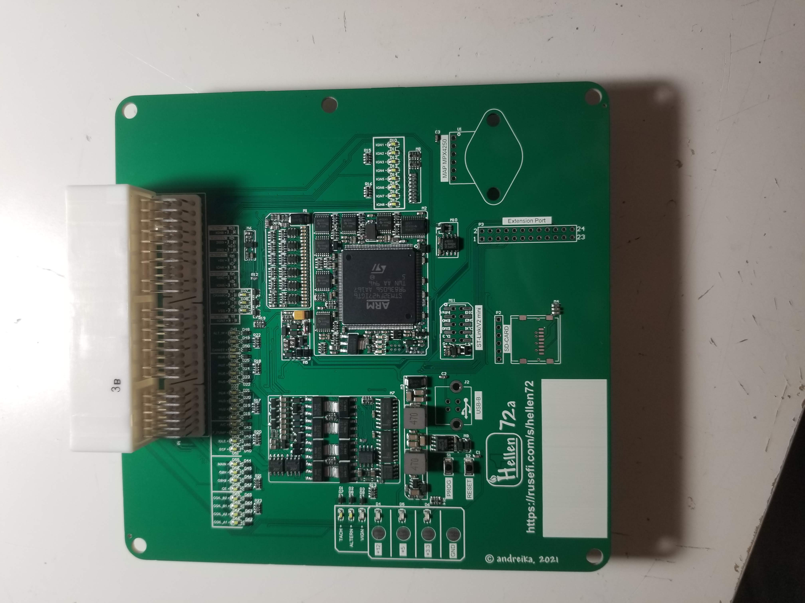

# hellen72

a rusEFI board with a 72 pin connector. Works for a Mazda Miata NB2 or any generic 8 cylinder vehicle :)

https://github.com/andreika-git/hellen-one

https://github.com/rusefi/rusefi/wiki/Hellen72

We love https://github.com/thesourcerer8/altium2kicad

https://github.com/rusefi/rusefi/wiki/Mazda-Miata-2001

https://github.com/rusefi/rusefi/wiki/Mazda-Miata-2003

